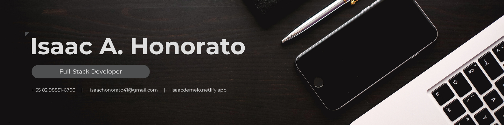

  

<!--
**IsaacDeMelo/IsaacDeMelo** is a ✨ _special_ ✨ repository because its `README.md` (this file) appears on your GitHub profile.
-->

## Olá!✨ Eu sou Isaac Ângelo.

### Curiosidades sobre mim
- 🎨 Fissurado por design.
- 🚀 Sempre aberto à explorar novas tecnologias.
- 🌍 Inglês, português e linguagem de programação.

 
  
  
  
  
  

